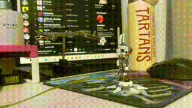
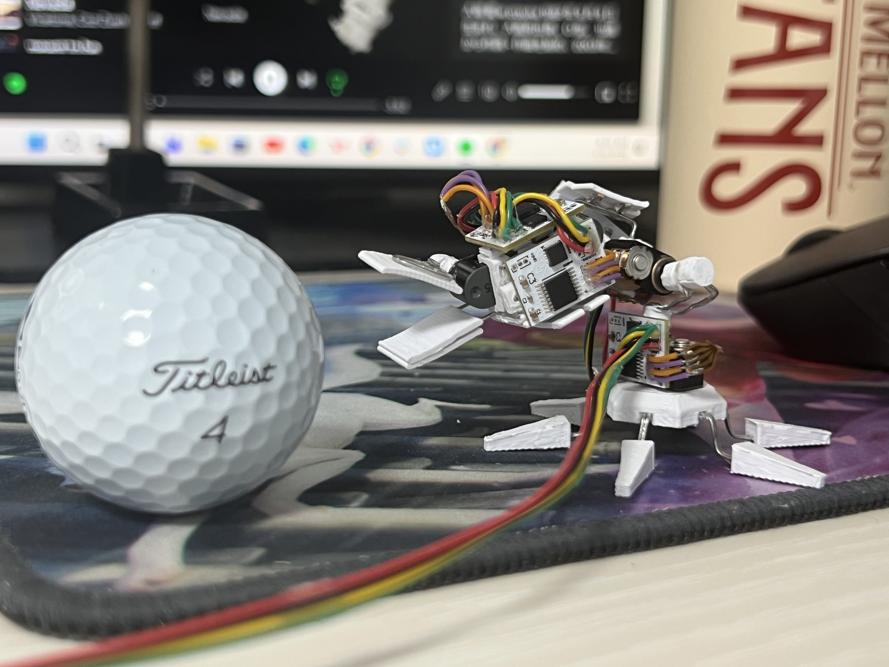
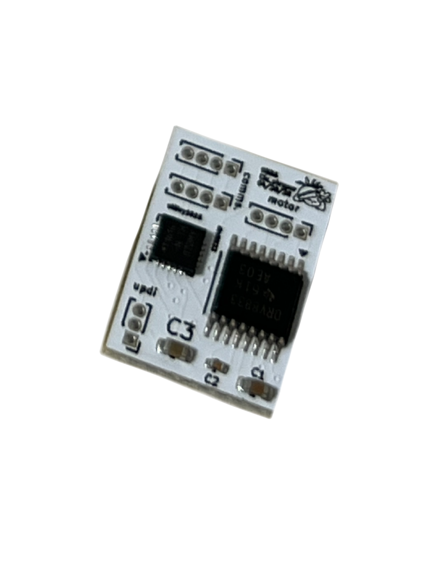

# DaisyStepper

DaisyStepper is a compact PCB module for daisy-chaining miniature stepper motors. Daisy-chaining makes it easier to expand motion systems while keeping wiring and cable management tidy, especially in robots with multiple joints such as miniature robot arms or humanoids.

The module is intended for hobby-scale miniature robotics, including tabletop companion robots, small animatronics, and compact robot arm builds.

## Mini Robot Arm Example

A mini robot arm example now demonstrates DaisyStepper modules controlling a multi-joint tabletop arm. The example highlights how the daisy-chainable motor modules reduce cable clutter around the joints while keeping the arm modular and easy to expand.

  

<em>Moving demo of the mini robot arm example.</em>

  

<em>Mini robot arm example build.</em>

## Hardware

The DaisyStepper module uses an **ATtiny1616** 8-bit AVR microcontroller and a **DRV8833** dual H-bridge motor driver. The ATtiny1616 acts as an I2C slave device and drives a miniature stepper motor through the DRV8833 based on motor commands received from an I2C master device, such as an Arduino, ESP32, Raspberry Pi, or other controller.

  

<em>DaisyStepper PCB module.</em>

## How It Works

1. An I2C master sends motor commands to one or more DaisyStepper modules on the bus.
2. Each module receives commands through its ATtiny1616 microcontroller.
3. The ATtiny1616 controls the DRV8833 dual H-bridge motor driver.
4. The DRV8833 actuates the connected miniature stepper motor.
5. Additional modules can be added to the chain for more joints or axes.

## Use Cases

- Miniature robot arms
- Tabletop companion robots
- Small animatronics
- Humanoid prototypes
- Compact multi-axis motion experiments
